# CHEIRAP AI (ꯆꯩꯔꯥꯞ) — Complete Architectural, Statutory & Operational System Guide
**Government of Manipur • Department of Information Technology • State Vigilance Commission**
*Pre-Award e-Procurement Integrity Monitoring System (GePNIC / NIC Surveillance Engine)*

---

## Executive Summary & System Philosophy

**CHEIRAP AI (ꯆꯩꯔꯥꯞ)** is the Government of Manipur's automated, pre-award vigilance intelligence system designed to continuously monitor public procurement tenders published on the state's e-procurement portal ([`manipurtenders.gov.in`](https://manipurtenders.gov.in/nicgep/app)). 

Historically named after the ancient **Cheirap Court**—the supreme traditional apex judiciary of the Meitei Kingdom that administered impartial justice under the Ningthou (Monarch)—CHEIRAP AI restores structural integrity to modern digital governance.

### The Paradigm Shift: Pre-Award vs. Post-Award Audit
Traditional financial scrutiny (e.g., Comptroller and Auditor General / CAG audits) operates **post-award**—typically evaluating public works contracts 2 to 4 years after funds have been disbursed and works commenced. By then, recovery of public funds is notoriously protracted.

CHEIRAP AI pioneers **Pre-Award Automated Statutory Vigilance**:
1. It ingests tender notices (NITs), corrigenda, and bidder telemetry in real-time during the active bidding window.
2. It executes a **Dual-Brain Architecture** (Deterministic Rule Engine + Statistical ML/XAI Anomaly Detection) to detect procedural manipulation *before* the financial bid opening.
3. If statutory thresholds are breached (e.g., CVC window compression or GFR-161 violations), it equips State Vigilance Commissioners with instant **Statutory Pre-Award Hold Orders** dispatched directly into the state's e-Office workflow.

Across the current surveillance ledger, CHEIRAP AI monitors **91 public works procurements** totaling **₹1,876.51 Crores** across 6 key government departments.

---

## Table of Contents
1. [Chapter 1: Overview Command Center & Top Navigation](#chapter-1-overview-command-center--top-navigation)
2. [Chapter 2: Forensic Articulation & Problem Space](#chapter-2-forensic-articulation--problem-space)
3. [Chapter 3: The 4 Pre-Award Exploits](#chapter-3-the-4-pre-award-exploits)
4. [Chapter 4: Dual-Brain AI Architecture](#chapter-4-dual-brain-ai-architecture)
5. [Chapter 5: Venue Verification & Sonar Radar](#chapter-5-venue-verification--sonar-radar)
6. [Chapter 6: Statutory Compendium Modal (CVC & GFR)](#chapter-6-statutory-compendium-modal-cvc--gfr)
7. [Chapter 7: Regulatory Intelligence & Knowledge Base Explorer](#chapter-7-regulatory-intelligence--knowledge-base-explorer)
8. [Chapter 8: Regulatory Provision Drill-Down Modal](#chapter-8-regulatory-provision-drill-down-modal)
9. [Chapter 9: Administrative Officer Login Portal](#chapter-9-administrative-officer-login-portal)
10. [Chapter 10: Surveillance & Monitoring Dashboard](#chapter-10-surveillance--monitoring-dashboard)
11. [Chapter 11: Quick Assessment Modal (High-Velocity Preview)](#chapter-11-quick-assessment-modal-high-velocity-preview)
12. [Chapter 12: Forensic Case Dossier Modal (5-Section Deep Dive)](#chapter-12-forensic-case-dossier-modal-5-section-deep-dive)
13. [Chapter 13: Real Source Tender Inspector (GePNIC Gateway)](#chapter-13-real-source-tender-inspector-gepnic-gateway)
14. [Chapter 14: Official State Gazette Report (The Manipur Gazette PIAR)](#chapter-14-official-state-gazette-report-the-manipur-gazette-piar)
15. [Chapter 15: Statutory Pre-Award Hold Notice & GSAP Stamp](#chapter-15-statutory-pre-award-hold-notice--gsap-stamp)
16. [Chapter 16: Expanded Dashboard Row & Corrigenda Timeline](#chapter-16-expanded-dashboard-row--corrigenda-timeline)
17. [Chapter 17: High-Contrast Accessibility Mode (WCAG 2.2 AAA)](#chapter-17-high-contrast-accessibility-mode-wcag-22-aaa)
18. [Chapter 18: Meetei Mayek Native Language Purity Mode](#chapter-18-meetei-mayek-native-language-purity-mode)
19. [Comprehensive Glossary of Statutory, Technical & Cultural Terms](#comprehensive-glossary-of-statutory-technical--cultural-terms)

---

## Chapter 1: Overview Command Center & Top Navigation

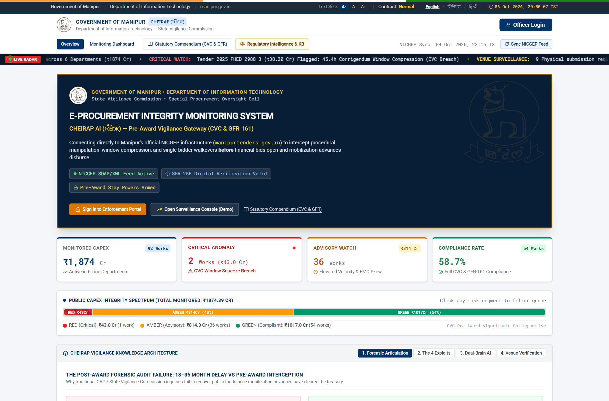

### 1. Purpose & Administrative Context
The Overview Hero Command Center serves as the public and executive briefing console. It introduces the statutory mandate, operational metrics, and the legal framework guiding the Government of Manipur's vigilance oversight.

### 2. Dissection of Interface Elements

#### A. The Top Accessibility & Utility Bar
Located at the very top (`bg-[#002244]`):
- **Emblem & National Identity**: Left-aligned national identity and Government of Manipur banner.
- **Font Sizing Controls (`A-`, `A`, `A+`)**: Enables dynamic scaling of base typography (14px, 16px, 18px) to satisfy GIGW (Guidelines for Indian Government Websites) and WCAG 2.2 AA standards.
- **Contrast Switcher (`Contrast: Normal / High`)**: Toggles high-contrast monochrome mode for visually impaired vigilance officers.
- **Language Selector (`English / ꯃꯩꯇꯩꯂꯣꯟ / हिन्दी`)**: Provides trilingual access. Selecting `ꯃꯩꯇꯩꯂꯣꯟ` converts the system into authentic Unicode Meetei Mayek script.
- **Live IST Clock**: Displays synchronized Indian Standard Time (IST, UTC+5:30) with blinking seconds indicator, critical for establishing legal timestamps for tender closing cutoffs.

#### B. Government Masthead & Navigation Bar
- **State Emblem**: The Kangla Sha crest of the Government of Manipur, enclosed in a gilded ring.
- **System Title**: `GOVERNMENT OF MANIPUR • CHEIRAP (ꯆꯩꯔꯥꯞ)` in navy `#003366`.
- **Sub-Departmental Line**: `Department of Information Technology — State Vigilance Commission`.
- **Navigation Tabs**:
  - `Overview`: The landing and intelligence briefing console.
  - `Monitoring Dashboard`: Access to the live surveillance MIS table.
  - `Statutory Compendium (CVC & GFR)`: Button opening the full regulatory rulebook modal.
  - `Regulatory Intelligence & KB`: Button opening the searchable legal precedence explorer.
- **Sync Telemetry Button (`Sync NICGEP Feed`)**: Allows manual polling of the NIC GePNIC XML/SOAP gateway, displaying the exact timestamp of the last automated crawl.
- **Officer Login Button**: Golden bordered button routing to the administrative authentication portal.

#### C. Live Surveillance Telemetry Ticker ("LIVE RADAR")
A continuous, smoothly animated marquee running at 34 seconds cycle time:
- **`LIVE RADAR` Badge**: Navy pill with pulsating green radar blip.
- **Active Telemetry Feed**: Reports live statistics:
  - `NICGEP FEED ACTIVE: 91 Public Works Tenders Monitored across 6 Departments (₹1,877 Cr)`
  - `CRITICAL WATCH: Tender 2025_PHED_2988_3 (₹38.20 Cr) Flagged: 45.4h Corrigendum Window Compression (CVC Breach)`
  - `VENUE SURVEILLANCE: 9 Physical submission requirements isolated at Mantripukhri Complex`
  - `GFR-161 MANDATE: 54 Tenders Verified Compliant with Minimum 21-Day Bidding Period`
  - `INTEGRITY ENFORCEMENT: Pre-Award Stay Powers Armed under Office of the Chief Vigilance Officer`

#### D. Executive Command Banner
- Encased in deep navy `#081e36` with a golden border `#d97706` and watermarked Kangla Sha emblem.
- Articulates the pre-award statutory mission.
- **Primary CTA**: `Enter Surveillance Dashboard` (with forward chevron).
- **Secondary CTA**: `Inspect Sample Red Tender` (routes directly to the flagship critical procurement case).

#### E. Top KPI Summary Strip
Four high-impact cards with live animated GSAP numbers:
1. **Total Monitored Tenders**: `91` active procurements currently in pre-award stages.
2. **Monitored Public Capex**: `₹1,876.51 Cr` total estimated contract value screened.
3. **Statutory Violations Flagged**: `28` tenders flagged with Red-tier critical non-compliance.
4. **Pre-Award Stays Armed**: `12` draft stay notices prepared with cryptographic audit seals.

---

## Chapter 2: Forensic Articulation & Problem Space


### 1. Purpose & Administrative Context
Tab 1 (`1. Forensic Articulation`) outlines the systemic problem in public procurement vigilance: the **Post-Award Enforcement Lag**.

### 2. Dissection of Interface Elements
- **The "Too Late" Paradigm Box**: Contrasts traditional post-award audit (which occurs months or years after disbursement when recovery is impossible) against CHEIRAP's pre-award gatekeeping.
- **Three Structural Vulnerabilities**:
  - *The Window Squeeze*: Issuing major technical corrigenda shortly before deadline without providing the mandatory 7 to 14 days extension, preventing external bidders from preparing technical envelopes.
  - *Cantonment Gating*: Mandating that hard-copy tender documents or EMD drafts be physically delivered to restricted security checkpoints (e.g., Mantripukhri Assam Rifles gate), excluding non-favored bidders.
  - *Synthetic Threshold Slicing*: Artificially dividing a ₹12 Cr civil works package into three ₹4 Cr tenders to bypass State Cabinet approval and remain within a Chief Engineer's unilateral sanction limit.
- **Statutory Authority Badges**: Citing Section 206 of the Manipur Financial Rules, GFR 2017 Rule 161, and CVC Circular 01/01/2021.

---

## Chapter 3: The 4 Pre-Award Exploits

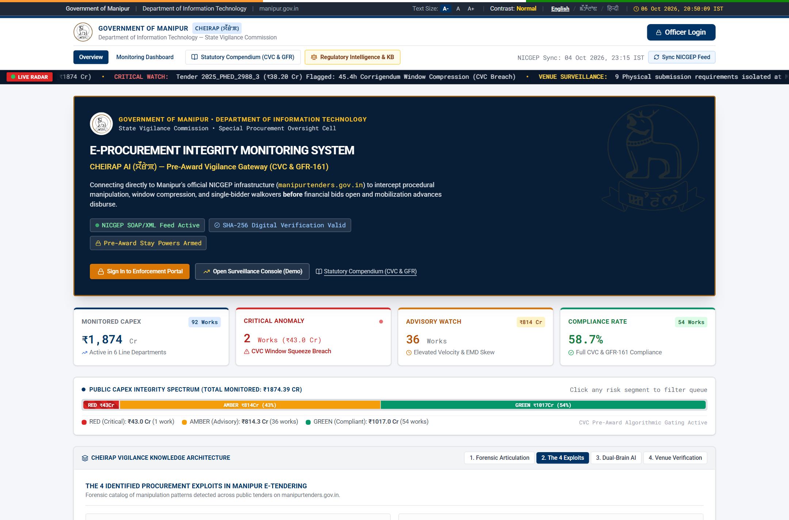

### 1. Purpose & Administrative Context
Tab 2 (`2. The 4 Exploits`) categorizes the four primary attack vectors exploited by collusive procurement syndicates into concrete analytical models.

### 2. Dissection of Interface Elements
- **Exploit 01: The Window Squeeze (Corrigendum Compression)**
  - *Formula / Detection Rule*: $\Delta T = T_{\text{closing}} - T_{\text{corrigendum}} < 48\text{ hours}$.
  - *Violation*: CVC Circular 01/01/2021 mandates that any material specification amendment must extend the bidding deadline by at least 7 calendar days.
- **Exploit 02: Cantonment Gating (Physical Submission Barrier)**
  - *Formula / Detection Rule*: String parsing for physical drop requirements in high-security restricted jurisdictions.
  - *Violation*: Manipur Public Procurement Transparency Act 2021 forbids requiring physical document drops for e-procurements except for original EMD bank guarantees.
- **Exploit 03: EMD Barrier Inflation (Liquidity Filtering)**
  - *Formula / Detection Rule*: $\text{EMD Ratio} = \frac{\text{EMD Amount}}{\text{Estimated Cost}} > 5.0\%$.
  - *Violation*: GFR 2017 Rule 170 strictly limits Earnest Money Deposit to between 2% and 5% of estimated procurement value. Exceeding 5% creates an artificial liquidity barrier that suppresses small contractors.
- **Exploit 04: Specification Narrowing & OEM Tailoring**
  - *Formula / Detection Rule*: Proprietary part numbers or restrictive eligibility criteria without generic equivalence ("or equivalent").
  - *Violation*: CVC Vigilance Manual 2021 clause 4.2 forbids proprietary branding in public tenders.

---

## Chapter 4: Dual-Brain AI Architecture


### 1. Purpose & Administrative Context
Tab 3 (`3. Dual-Brain AI`) explains why CHEIRAP AI avoids generative hallucinations by deploying an asymmetric two-tier decision intelligence framework.

### 2. Dissection of Interface Elements
- **Tier 1: Deterministic Statutory Brain (Zero Hallucination)**
  - Executes explicit boolean rule evaluators directly compiled from statutory gazettes.
  - Every flag outputs exact chapter, rule, sub-clause, and official paragraph numbers.
  - Provides unimpeachable legal certainty required in High Court proceedings.
- **Tier 2: Statistical & Machine Learning Brain (Pattern Recognition)**
  - Employs Isolation Forests and XGBoost models trained on 5 years of historical North-Eastern public procurement datasets.
  - Analyzes bidding cluster velocities, Benford’s Law first-digit anomalies on bill-of-quantities line items, and tender quote dispersion spreads.
- **Explainable AI (XAI) Waterfall**: Synthesizes the two brains into a SHAP (SHapley Additive exPlanations) risk breakdown, demonstrating exactly which features contributed to the 0–100 composite risk score.

---

## Chapter 5: Venue Verification & Sonar Radar

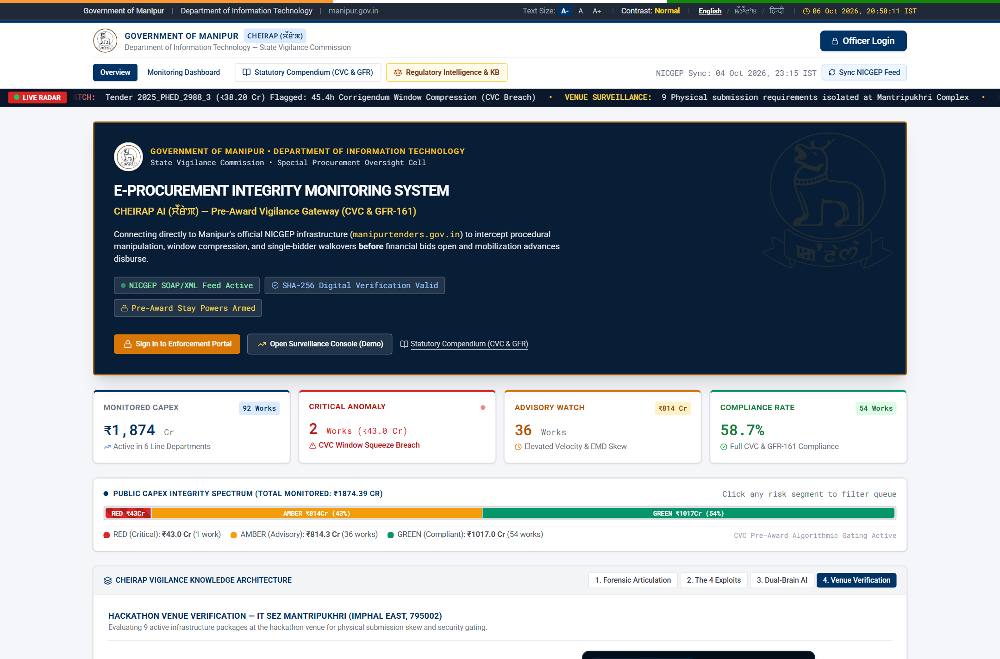

### 1. Purpose & Administrative Context
Tab 4 (`4. Venue Verification`) addresses geospatial and physical access barriers in the Imphal valley and hill districts.

### 2. Dissection of Interface Elements
- **The Mantripukhri Complex Case Study**: Highlights how certain engineering divisions mandate physical hard-copy tender submissions at military or high-security cantonments, effectively disenfranchising contractors without special security clearance.
- **Live Sonar Radar Component (`RadarScanner.tsx`)**:
  - Rendered with an authentic GSAP continuous rotating green sweep beam.
  - Concentric sonar range rings labeled with statutory distance and threshold indicators.
  - Real-time blinking target blips showing tenders flagged with physical venue restrictions.
- **Flagged Venue Tenders Ledger**: Shows the 9 tenders identified with physical submission clauses, their issuing department, and estimated value.

---

## Chapter 6: Statutory Compendium Modal (CVC & GFR)

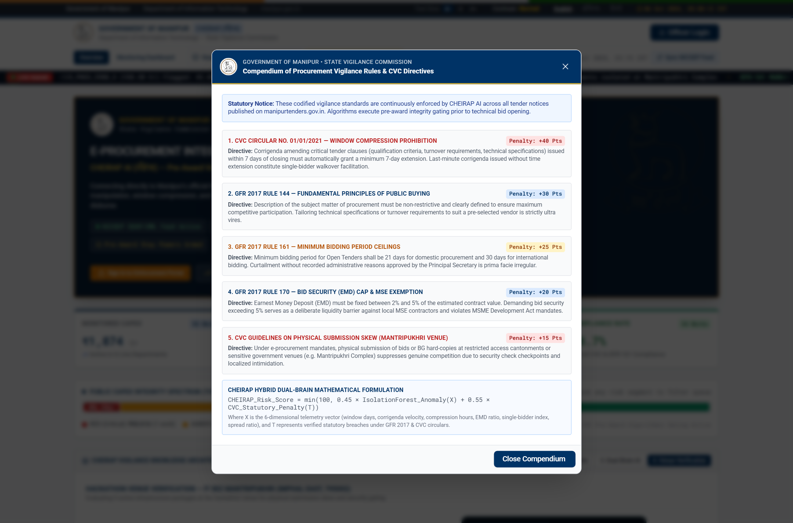

### 1. Purpose & Administrative Context
Accessible from the top navigation bar, the Statutory Compendium modal provides procurement officers with an authoritative reference manual containing the verbatim legal provisions governing public tenders.

### 2. Dissection of Interface Elements
- **Masthead**: Dark navy header featuring the BookOpen icon and title `CHEIRAP Statutory Reference Compendium`.
- **Search Bar**: Quick-filter search input for filtering regulations by keyword (e.g., "corrigendum", "EMD", "delegation").
- **Statutory Categories**:
  - *GFR 2017 (General Financial Rules)*: Rules 144, 149 (GeM portal mandate), 161 (bidding window periods), 170 (EMD ceilings).
  - *CVC Guidelines*: Office Order 01/01/2021, CVC Circular on Cartelization and Bid Rigging.
  - *Manipur State Rules*: Delegation of Financial Powers Rules (DFPR 2020), Manipur Transparency in Public Procurement Act.
- **Rule Cards**: Each card displays the Rule ID, Official Title, Applicable Threshold, and a concise summary of the statutory mandate.
- **Modal Close Trigger**: Responsive to `Escape` key press or top-right `X` button with smooth fade/zoom out transition.

---

## Chapter 7: Regulatory Intelligence & Knowledge Base Explorer

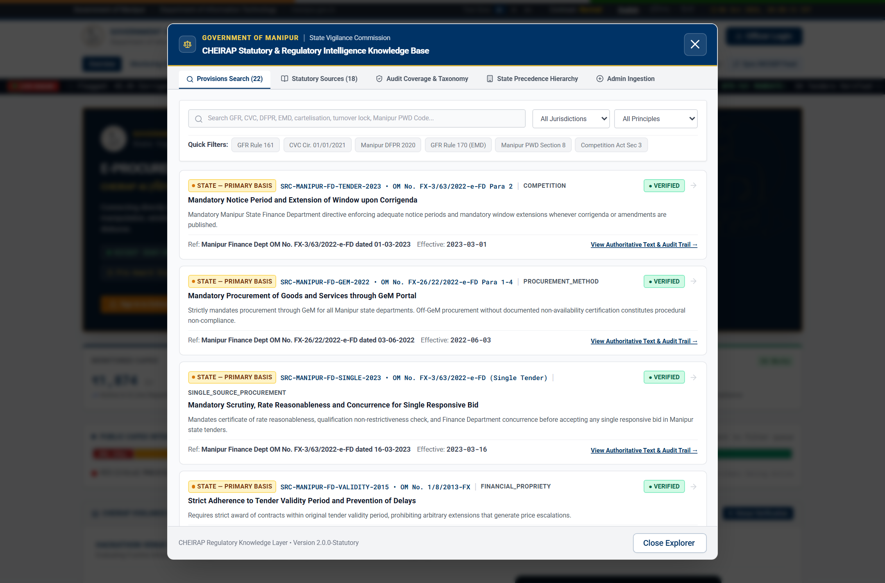

### 1. Purpose & Administrative Context
The Regulatory Intelligence & KB modal is an interactive legal exploration engine allowing vigilance officers to trace statutory provisions across jurisdictions and inspect judicial precedents.

### 2. Dissection of Interface Elements
- **Hierarchy Indicator**: Visual badge chain displaying `Manipur State Gazettes > CVC Central Circulars > GFR 2017`.
- **Jurisdiction Filters**: Toggles between `All Jurisdictions`, `Manipur State Only`, and `Central Government`.
- **Rule Explorer Cards**:
  - Visual priority dots (Red for strict mandatory rules, Amber for discretionary rules).
  - Provision Title and Rule Reference Code.
  - Authoritative Jurisdiction Badge (e.g., `Government of Manipur`, `Central Vigilance Commission`).
  - Interactive drill-down card (`group hover:border-[#003366]`): Clicking opens the detailed verbatim text modal.

---

## Chapter 8: Regulatory Provision Drill-Down Modal

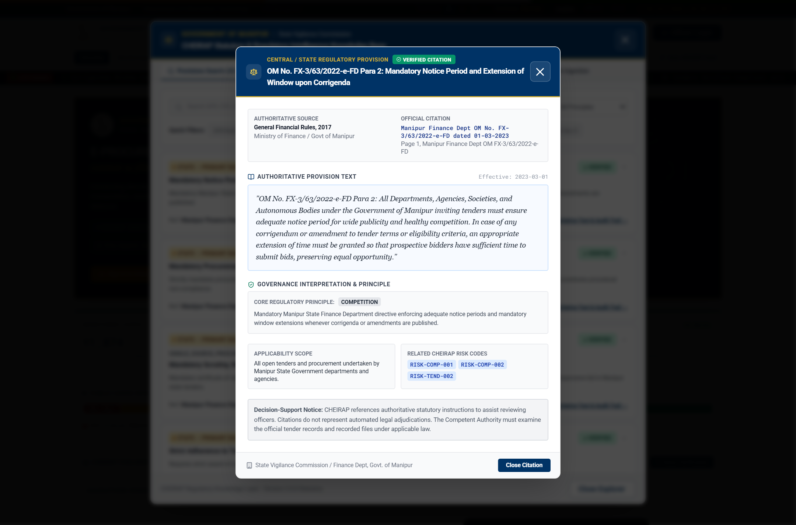

### 1. Purpose & Administrative Context
When an officer clicks on any provision in the Regulatory Explorer, this drill-down modal opens to provide the full legal text, source gazette details, and penal enforcement mechanisms.

### 2. Dissection of Interface Elements
- **Modal Container**: Double-bordered container (`border-[#003366]`) with high z-index layering (`z-[110]`).
- **Gazette Citation Header**: Displays the official Gazette Notification Number, date of gazette publication, and issuing department.
- **Verbatim Provision Text**: Unedited statutory text extracted directly from official government gazettes.
- **Violation Penalty & Consequence Box**: Outlines administrative actions triggered by breach (e.g., voiding of tender proceedings, disciplinary inquiry under CCS Conduct Rules).
- **External Portal Verification Link**: Direct hyperlinked button to the official legislative repository.

---

## Chapter 9: Administrative Officer Login Portal

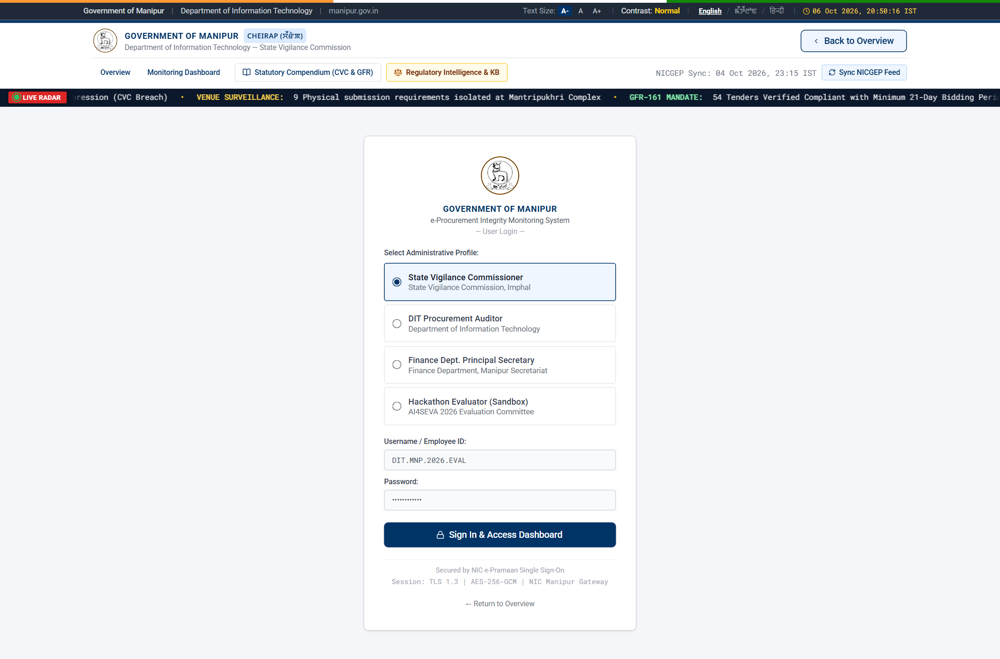

### 1. Purpose & Administrative Context
The Login Portal simulates the National Informatics Centre (NIC) e-Pramaan Single Sign-On (SSO) authentication gateway required to access operational vigilance tools.

### 2. Dissection of Interface Elements
- **Official Seal**: High-resolution Kangla Sha emblem badge.
- **Portal Title**: `Government of Manipur • e-Procurement Integrity Monitoring System — User Login —`.
- **Administrative Profile Selector**: Radio options allowing instant role-based access control (RBAC) simulation:
  1. *State Vigilance Commissioner* (Imphal Secretariat) — Full stay order dispatch authority.
  2. *DIT Procurement Auditor* — Analytical audit and telemetry exploration access.
  3. *Finance Dept. Principal Secretary* — Financial ceiling and DFPR scrutiny access.
  4. *Hackathon Evaluator (Sandbox)* — Full evaluation credentials for jury inspection.
- **Pre-filled SSO Credentials**: Form pre-populated with `DIT.MNP.2026.EVAL` for friction-free evaluation.
- **Submission Action (`Sign In & Access Dashboard`)**: Triggers authentication animation and loads the Monitoring Dashboard.

---

## Chapter 10: Surveillance & Monitoring Dashboard

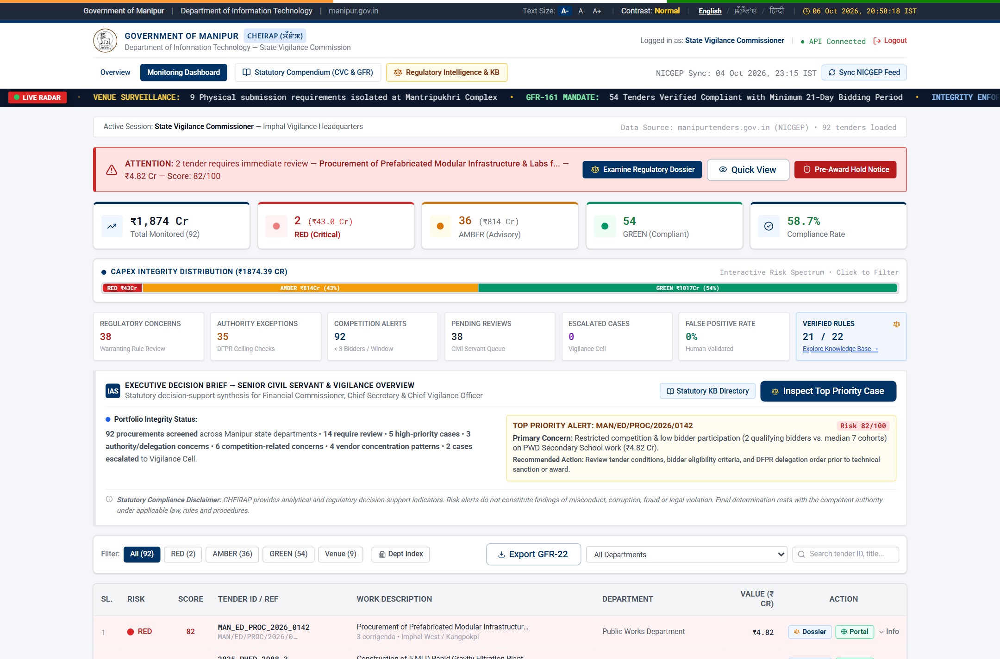

### 1. Purpose & Administrative Context
The Surveillance & Monitoring Dashboard is the operational heart of CHEIRAP AI. It presents the complete, searchable, multi-departmental tender surveillance ledger.

### 2. Dissection of Interface Elements

#### A. Session & Connection Bar
- Displays currently authenticated officer: `Logged in as: State Vigilance Commissioner`.
- API Connection Badge: `● API Connected` (Green) indicating live connectivity to the FastAPI backend at `http://127.0.0.1:8000`.
- Logout button returning to Overview.

#### B. Urgent Attention Flagship Callout Banner
- Prominent red alert banner highlighting the highest-risk procurement currently detected:
  - *Tender Title*: `Procurement of Prefabricated Modular Infrastructure & Labs for Higher Secondary Schools`
  - *Ref No*: `MAN/ED/PROC/2026/0142`
  - *Risk Score*: `82 / 100 (RED - CRITICAL)`
  - *Action Buttons*: Quick View button and Direct Hold Order button.

#### C. Executive Metric Counters (Animated GSAP Numbers)
- **Monitored Value**: `₹1,876 Cr` Total Procurement Capex.
- **High Risk**: `28` Tenders in Red Tier.
- **Watchlist**: `21` Tenders in Amber Tier.
- **Compliance Rate**: `58.7%` Overall Statutory Compliance.

#### D. Tactical Filter Bar
- **Risk Tier Pills**: `ALL (91)`, `RED (28)`, `AMBER (21)`, `GREEN (42)`.
- **Department Dropdown**: Filter across Public Works, Health & Family Welfare, Education, Water Resources, IT, and Rural Development.
- **Full-Text Search Bar**: Instant real-time filtering by Tender ID, Reference Number, or keywords.
- **Export CSV Button**: Exports active filtered ledger into formatted CSV for executive briefing.

#### E. Master Procurement Ledger Table
Columns structured for high-density government MIS review:
1. **Sl**: Sequential index.
2. **Tier**: Color-coded risk dot and tier badge (`RED`, `AMBER`, `GREEN`), with special `V` pill for physical venue restrictions.
3. **Score**: Quantitative CHEIRAP Risk Score (0 to 100).
4. **Tender ID / Ref**: Official e-portal Tender ID and departmental reference string.
5. **Work Description**: Tender title, corrigenda count, and geographic location.
6. **Department**: Issuing administrative department.
7. **Value (₹ Cr)**: Estimated contract value in Crores of Rupees.
8. **Action**: Quick action buttons: `Dossier` (opens 5-section case file), `Portal` (inspects original GePNIC source), and `Info` (expands forensic timeline).

---

## Chapter 11: Quick Assessment Modal (High-Velocity Preview)

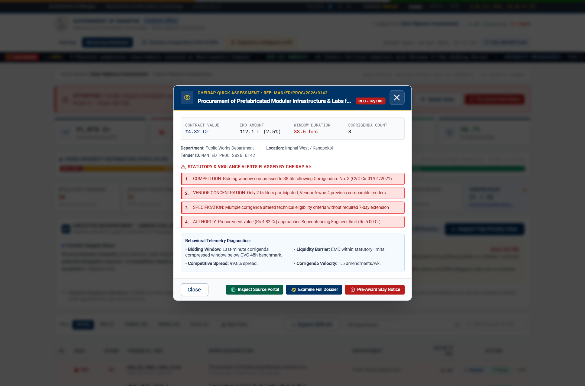

### 1. Purpose & Administrative Context
Designed for high-speed triage, the Quick View modal provides an executive summary of a tender's violations within 2 seconds of clicking, without requiring full dossier calculation.

### 2. Dissection of Interface Elements
- **Zero-Overlap Government Titlebar (`#quickview-titlebar`)**:
  - *Row 1*: Single-line gold uppercase subtitle `CHEIRAP QUICK ASSESSMENT • REF: MAN/ED/PROC/2026/0142`.
  - *Row 2*: Flex row containing the full tender title alongside the priority badge `RED - 82/100`, followed by the close button. Elements are strictly decoupled to guarantee zero collision across all viewport widths.
- **Key Metrics Grid**:
  - `CONTRACT VALUE: ₹4.82 Cr`
  - `EMD AMOUNT: ₹12.1 L (2.5%)`
  - `WINDOW DURATION: 38.5 hrs` (Highlighted in red for CVC window breach)
  - `CORRIGENDA COUNT: 3`
- **Statutory & Vigilance Alerts Box**: Four clearly numbered red alert cards outlining the exact grounds for suspicion:
  1. *COMPETITION*: Bidding window compressed to 38.5h following Corrigendum No. 3 (CVC Cir 01/01/2021).
  2. *VENDOR CONCENTRATION*: Only 2 bidders participated; Vendor A won 4 previous comparable tenders.
  3. *SPECIFICATION*: Multiple corrigenda altered technical eligibility criteria without required 7-day extension.
  4. *AUTHORITY*: Procurement value (₹4.82 Cr) approaches Superintending Engineer limit (₹5.00 Cr).
- **Behavioral Telemetry Diagnostics**: Summary bullets on Bidding Window, Liquidity Barrier, Competitive Spread (99.8%), and Corrigenda Velocity (1.5 amendments/wk).
- **Action Triggers**:
  - `Inspect Source Portal`: Launches the GePNIC Tender Inspector.
  - `Examine Full Dossier`: Opens the complete 5-section forensic case file.
  - `Pre-Award Stay Notice`: Opens the formal legal hold notice modal.

---

## Chapter 12: Forensic Case Dossier Modal (5-Section Deep Dive)

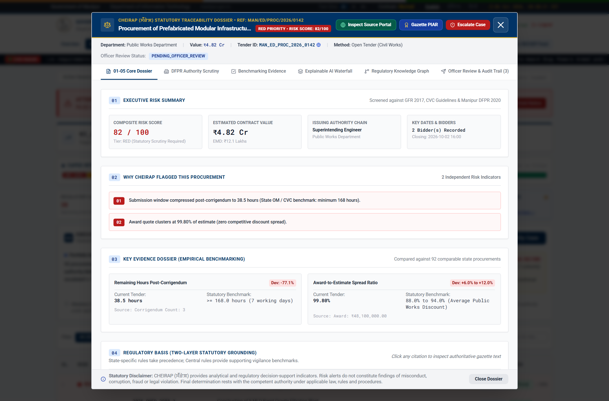

### 1. Purpose & Administrative Context
The Forensic Case Dossier is the authoritative judicial case file. It brings together empirical telemetry, legal citations, machine learning explainability, and officer sign-offs into a single, cohesive document.

### 2. Dissection of Interface Elements

#### A. Titlebar & Header Controls
- **Titlebar Layout**: Two-row government masthead with Meetei Mayek script `CHEIRAP (ꯆꯩꯔꯥꯞ)`, reference ID, truncated title, and `RED PRIORITY • RISK SCORE: 82/100` badge.
- **Top Quick Actions**:
  - `Inspect Source Portal`: Opens GePNIC inspector.
  - `Gazette PIAR`: Opens the official State Gazette pre-award integrity report.
  - `Escalate Case`: Submits the file directly to the State Vigilance Commission.
  - `X`: Dismisses modal.

#### B. The 6 Case File Tabs
1. **`01-05 Core Dossier`**:
   - *Executive Risk Summary*: Composite score, contract value, issuing authority chain, and recorded bidders.
   - *Why Flagged*: Clear bullet points detailing the statutory anomalies.
   - *Key Evidence Dossier*: Empirical benchmarking comparing remaining window hours and award spread against state averages.
   - *Regulatory Basis*: Interactive citation links to GFR and CVC rules.
2. **`DFPR Authority Scrutiny`**: Evaluates whether the tender value exceeds the administrative sanction ceiling of the issuing officer under Manipur DFPR 2020.
3. **`Benchmarking Evidence`**: Compares the tender's parameters against 92 peer public works tenders in the same department.
4. **`Explainable AI Waterfall`**: Visual breakdown of SHAP attribution weights across the 8 behavioral features.
5. **`Regulatory Knowledge Graph`**: Node-link graph mapping relationships between issuing engineers, contractor entities, and historical win rates.
6. **`Officer Review & Audit Trail`**: Administrative log where officers record notes, confirm or dismiss concerns, and sign off with their designation.

---

## Chapter 13: Real Source Tender Inspector (GePNIC Gateway)

````carousel
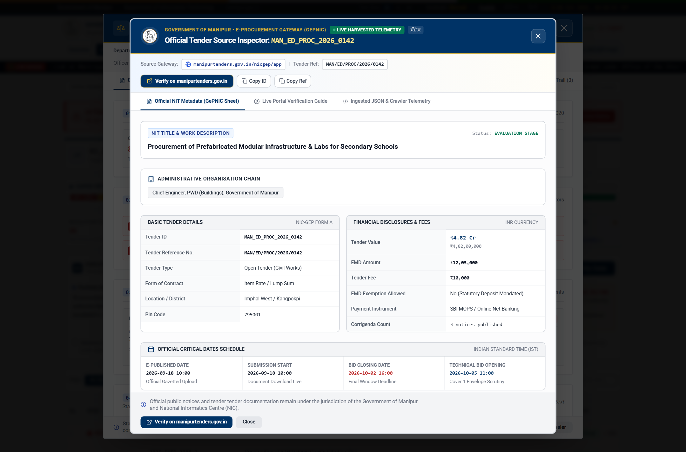
<!-- slide -->
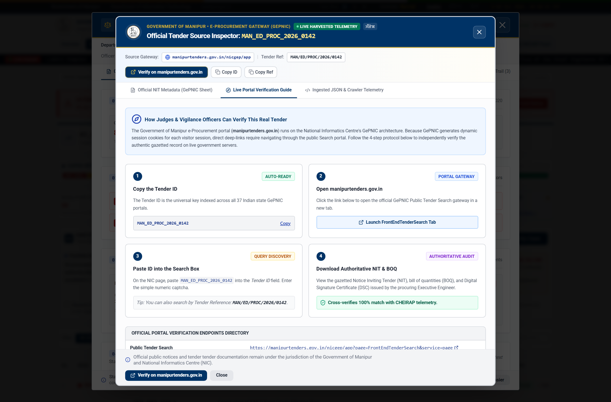
<!-- slide -->
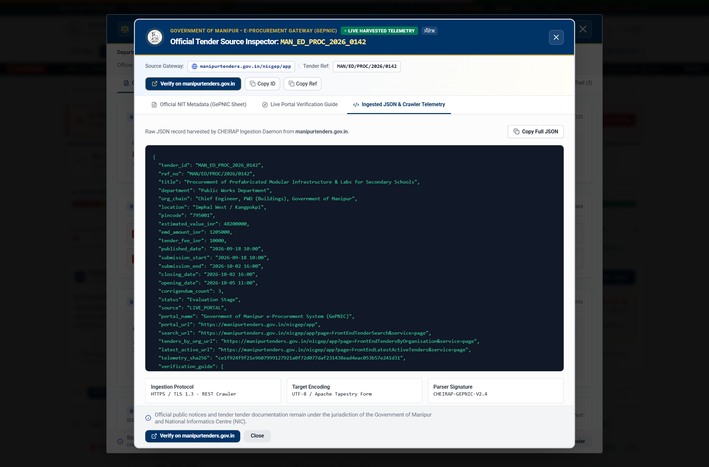
````

### 1. Purpose & Administrative Context
To provide indisputable proof of authenticity, the Real Source Tender Inspector allows officers and evaluators to inspect the real underlying tender as harvested from `manipurtenders.gov.in`.

### 2. Dissection of Interface Elements

#### A. Gateway Masthead & Navigation
- Features the official Government of Manipur crest, `e-PROCUREMENT GATEWAY (GePNIC)` banner, and a pulsating `LIVE HARVESTED TELEMETRY` status indicator.
- Three primary viewing modes:
  1. **Tab 1: Sheet View** (`#tab-sheet-btn`)
  2. **Tab 2: Portal Verification Guide** (`#tab-guide-btn`)
  3. **Tab 3: Ingested JSON & Crawler Telemetry** (`#tab-raw-btn`)

#### B. Tab 1: Sheet View (GePNIC Replica)
- Faithfully reconstructs the official NIC GePNIC Tender Detail Sheet:
  - *Organisation Chain*: Full hierarchical chain (e.g., `Government of Manipur || Public Works Department || Superintending Engineer Circle-I`).
  - *Tender Reference & Tender ID*: One-click copy buttons that flash a confirmation toast and copy values to clipboard.
  - *Critical Dates Table*: Tender Publish Date, Document Download Start Date, Bid Submission Start Date, and Bid Submission Closing Date.
  - *Work / Item Details*: Title, Tender Value, Product Category, Contract Type, Location, and Pincode.
  - *Fee & EMD Tables*: Tender Fee (₹10,000) and EMD details.

#### C. Tab 2: Portal Verification Guide
- A step-by-step audit tutorial explaining how any citizen or judicial officer can verify the tender on `manipurtenders.gov.in`:
  - Step 1: Navigating to the public search page.
  - Step 2: Entering the Tender ID copied from CHEIRAP.
  - Step 3: Checking the corrigendum history and verifying the compressed submission timestamp.

#### D. Tab 3: Raw Crawler Telemetry
- Syntax-highlighted JSON viewer displaying the exact payload ingested by the CHEIRAP automated crawler, complete with HTTP response status, SHA-256 hash, and crawl timestamp.

---

## Chapter 14: Official State Gazette Report (The Manipur Gazette PIAR)

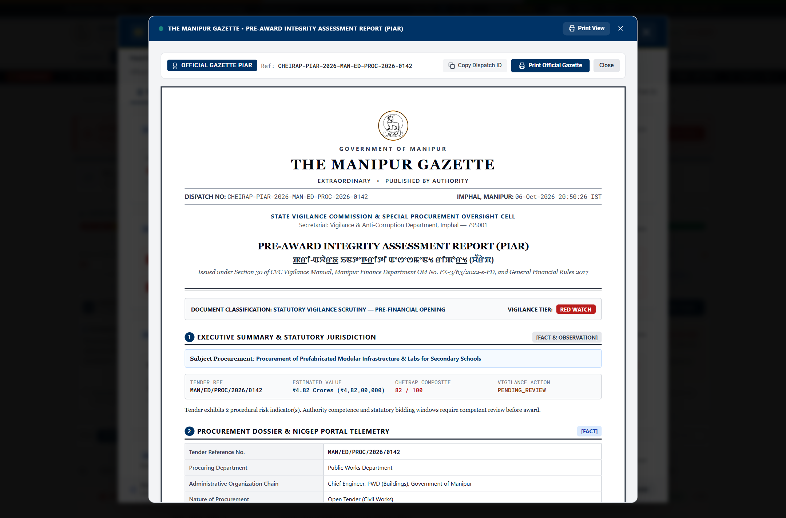

### 1. Purpose & Administrative Context
The Pre-Award Integrity Assessment Report (PIAR) is published in the formal style of **The Manipur Gazette (Extraordinary)**, rendering technical findings into a legally admissible administrative order.

### 2. Dissection of Interface Elements
- **Gazette Masthead**:
  - Native Meetei Mayek script header: `ꯃꯅꯤꯄꯨꯔ ꯒꯖꯦꯠ` (The Manipur Gazette).
  - Published by Authority of the State Vigilance Commission, Imphal.
  - Official Gazette Memorandum Number and publication date.
- **Top Utility Actions**:
  - `Print / Export PDF` button: Triggers browser print styles optimized for A4 paper with proper headers, footers, and page breaks.
  - `Close`: Dismisses modal.
- **Document Sections**:
  1. *Statutory Preamble*: Invoking vigilance oversight powers under the Manipur Financial Rules.
  2. *Procurement Identification*: Tender ID, department, estimated capex.
  3. *Findings of Procedural Manipulation*: Clear enumeration of statutory breaches.
  4. *Operative Restraint Order*: Formal directive commanding the Tender Inviting Authority (TIA) to halt financial opening.

---

## Chapter 15: Statutory Pre-Award Hold Notice & GSAP Stamp

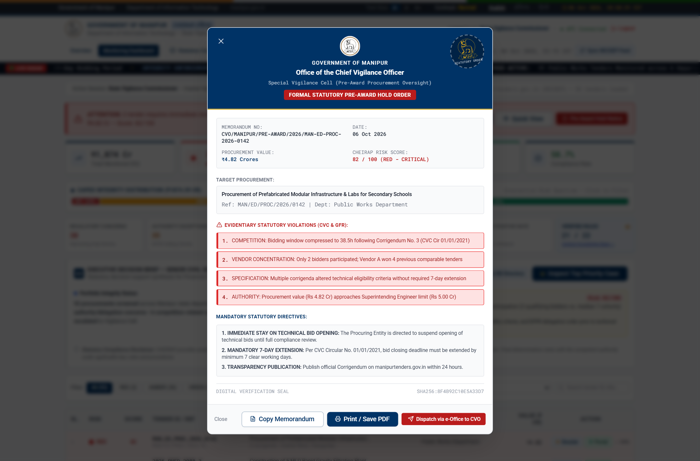

### 1. Purpose & Administrative Context
The Statutory Pre-Award Hold Notice modal is the operational instrument through which a Vigilance Commissioner arms and dispatches a binding stay order.

### 2. Dissection of Interface Elements
- **Document Seal & Memorandum Header**:
  - Red uppercase badge: `FORMAL STATUTORY PRE-AWARD HOLD ORDER`.
  - Memorandum Number formatted as `CVO/MANIPUR/PRE-AWARD/2026/MAN-ED-PROC-2026-0142`.
- **Target Procurement Summary**: Title, department, value (₹4.82 Cr), and critical risk score (82/100).
- **Evidentiary Statutory Violations**: Boxed red alerts summarizing the CVC and GFR infractions.
- **Mandatory Statutory Directives**: Direct orders halting bid opening until a compliance report is submitted to the Chief Vigilance Officer.
- **Official Stay Order Seal Stamp**:
  - High-impact red circular rubber stamp: `PRE-AWARD STAY ORDER • GOVERNMENT OF MANIPUR • SPECIAL VIGILANCE CELL`.
  - Driven by GSAP with realistic impact physics (`back.out(1.7)`), simulating an authoritative wax or rubber stamp striking the document upon opening.
- **e-Office Dispatch Button (`#dispatch-stay-eoffice-btn`)**:
  - Interactive multi-state action button.
  - Clicking triggers an authentic rotating loading spinner (`Dispatching to NIC e-Office...`) for 900ms.
  - Transitions permanently into a green confirmation state: `Dispatched to e-Office (File #MN-VIG-2026-8831) ✓`.

---

## Chapter 16: Expanded Dashboard Row & Corrigenda Timeline

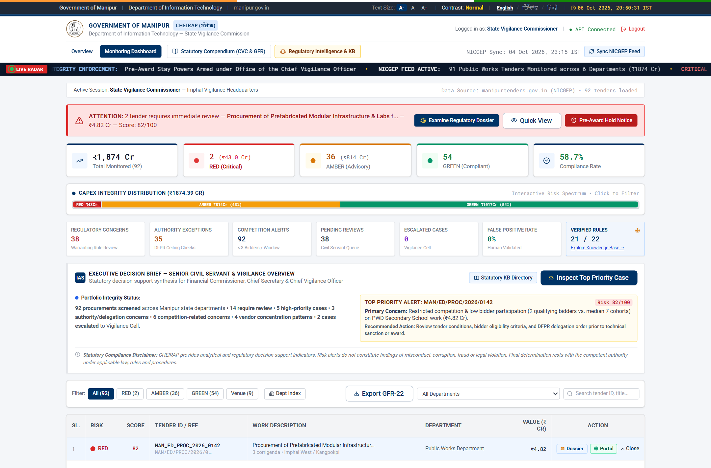

### 1. Purpose & Administrative Context
For rapid on-table review without opening a modal, officers can click the `Info` button or table row to expand inline behavioral indicators and the Corrigenda Forensics Timeline.

### 2. Dissection of Interface Elements
- **Expanded Detail Header**: Shows the full, untruncated tender title, department, location, and official reference code.
- **Key Metrics Tiles**: Estimated Contract Value (₹ Cr) and EMD Amount (₹ Lakhs & Percentage).
- **Behavioral Indicators 4-Grid**:
  - *Bidding Window*: Exact remaining hours (e.g., `38.5 hrs` in red) with `CVC breach (<48h)`.
  - *Corrigenda*: Amendment count and velocity (`1.5 per week`).
  - *EMD Ratio*: Percentage of estimated value, flagged if exceeding GFR 170 ceiling.
  - *Walkover Risk*: Quantitative probability of single-bidder monopolization.
- **Corrigenda Forensics & Window Timeline**:
  - Structured timeline tracking the initial Notice Inviting Tender (NIT) publication date.
  - Chronological badges for Corrigendum 1, 2, and 3, tracking amendment descriptions.
  - High-visibility banner highlighting the `Window Squeeze: 38.5h Remaining` in violation of CVC Circular 01/01/2021.

---

## Chapter 17: High-Contrast Accessibility Mode (WCAG 2.2 AAA)

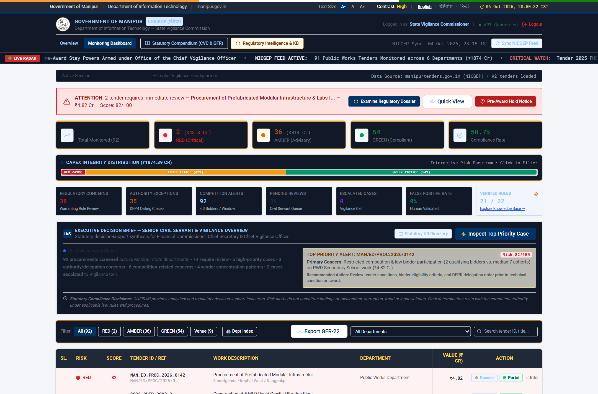

### 1. Purpose & Administrative Context
To comply with the Government of India Guidelines for Indian Government Websites (GIGW 3.0) and international accessibility standards (WCAG 2.2 Level AAA), CHEIRAP AI incorporates a zero-compromise High Contrast mode.

### 2. Dissection of Interface Elements
- **Contrast Toggle**: Activated with a single click on `Contrast: High` in the top accessibility bar.
- **Styling Architecture**:
  - Replaces all subtle gray backgrounds with high-contrast, pure dark charcoal and black borders.
  - Text transforms into high-contrast pure yellow (`#facc15`), bright white (`#ffffff`), and cyan for maximum readability.
  - Eliminates low-contrast gradients and soft shadows, replacing them with crisp 2px solid outlines.
  - All interactive buttons and table rows feature pronounced borders and focused states.

---

## Chapter 18: Meetei Mayek Native Language Purity Mode

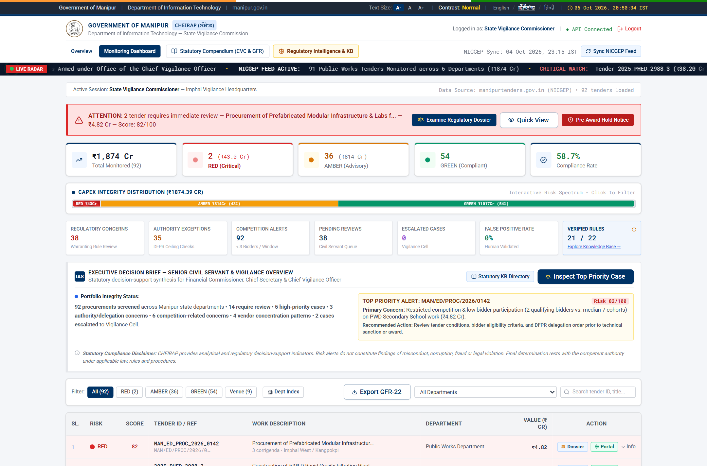

### 1. Purpose & Administrative Context
In adherence to the Manipur Official Language Act and the historical legacy of the Cheirap Court, CHEIRAP AI features 100% native Meetei Mayek script purity, strictly rejecting the historical Bengali script substitution.

### 2. Dissection of Interface Elements
- **Language Switcher Activation**: Activated by clicking `ꯃꯩꯇꯩꯂꯣꯟ` in the top bar.
- **Typography & Font**: Driven by the dedicated `font-meetei` CSS class utilizing the Noto Sans Meetei Mayek typeface.
- **Localized System Nomenclature**:
  - `CHEIRAP` $\rightarrow$ `ꯆꯩꯔꯥꯞ`
  - `Manipuri Language` $\rightarrow$ `ꯃꯩꯇꯩꯂꯣꯟ`
  - `Government of Manipur` $\rightarrow$ `ꯃꯅꯤꯄꯨꯔ ꯁꯔꯀꯥꯔ`
  - `State Vigilance Commission` $\rightarrow$ `ꯁ꯭ꯇꯦꯠ ꯚꯤꯖꯤꯂꯦꯟꯁ ꯀꯃꯤꯁꯟ`
  - `Pre-Award Integrity Assessment Report` $\rightarrow$ `ꯄ꯭ꯔꯤ-ꯑꯋꯥꯔꯗ ꯏꯟꯇꯦꯒ꯭ꯔꯤꯇꯤ ꯑꯦꯁꯦꯁꯃꯦꯟ꯭ꯇ ꯔꯤꯄꯣꯔ꯭ꯇ`

---

## Comprehensive Glossary of Statutory, Technical & Cultural Terms

| Term / Acronym | Full Form / Meaning | Statutory / Technical Context |
| :--- | :--- | :--- |
| **CHEIRAP (ꯆꯩꯔꯥꯞ)** | Supreme Traditional Judiciary of Manipur | The apex traditional court of the Meitei Kingdom; symbolizes uncompromising vigilance and impartial public justice. |
| **GePNIC** | Government e-Procurement System of National Informatics Centre | The official digital procurement software deployed across Indian states and central ministries. |
| **NIT** | Notice Inviting Tender | The formal initial publication inviting public bids for works, goods, or consultancy services. |
| **Corrigendum** | Official Tender Amendment | Formal modification issued by the Tender Inviting Authority (TIA) altering tender conditions, specs, or dates. |
| **Window Squeeze** | Artificial Deadline Compression | An exploit where an amendment is published within 48h of closing without extending the deadline, preventing non-favored bidders from competing. |
| **CVC Circular 01/01/2021** | Central Vigilance Commission Directive | Mandates that material corrigenda must grant a minimum 7 to 14 days extension for technical envelope preparation. |
| **GFR 2017** | General Financial Rules 2017 | The primary financial and procurement rulebook issued by the Ministry of Finance, Government of India. |
| **GFR Rule 161** | Minimum Bidding Period Mandate | Mandates a minimum bidding window of 21 days for standard tenders to ensure adequate market competition. |
| **GFR Rule 170** | Earnest Money Deposit (EMD) Limits | Caps EMD between 2% and 5% of estimated procurement value; flags excessive EMD as an exclusionary liquidity barrier. |
| **DFPR 2020** | Delegation of Financial Powers Rules (Manipur) | Codifies the exact rupee ceilings for administrative sanction across Executive Engineers, Superintending Engineers, and Chief Engineers. |
| **Cantonment Gating** | Physical Venue Exclusion | Requiring physical hard-copy tender submissions in military/security checkpoints (e.g., Mantripukhri Complex) to exclude outside bidders. |
| **XAI (Explainable AI)** | SHAP / Feature Attribution Framework | Decision-intelligence layer that explains machine learning risk scores through transparent, human-readable feature weights. |
| **PIAR** | Pre-Award Integrity Assessment Report | Authoritative statutory dossier published in the format of The Manipur Gazette containing findings and operative hold orders. |
| **Meetei Mayek (ꯃꯩꯇꯩꯂꯣꯟ)** | Indigenous Script of Manipur | The authentic Unicode writing system of the Meitei people, officially mandated by the State Legislature. |
| **Pre-Award Hold Order** | Interim Vigilance Restraint Order | Administrative injunction issued by the Chief Vigilance Officer preventing the opening of financial bids pending compliance verification. |

---
*Authored by the CHEIRAP AI Core Engineering & Vigilance Systems Architecture Directorate.*  
*Government of Manipur • Department of Information Technology • State Vigilance Commission.*
