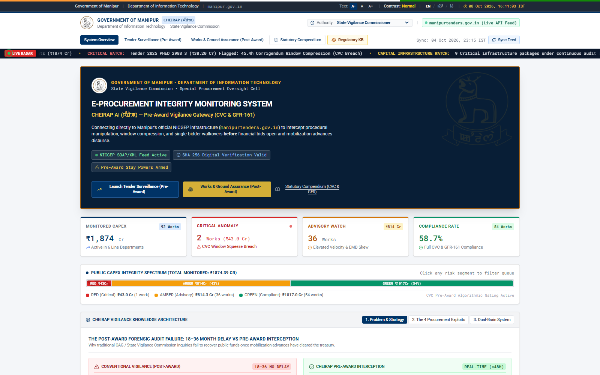
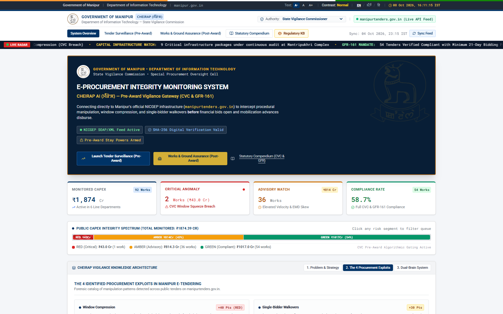
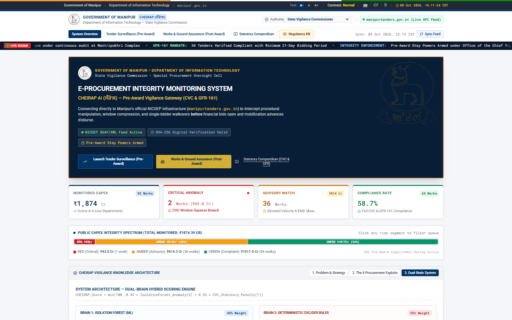
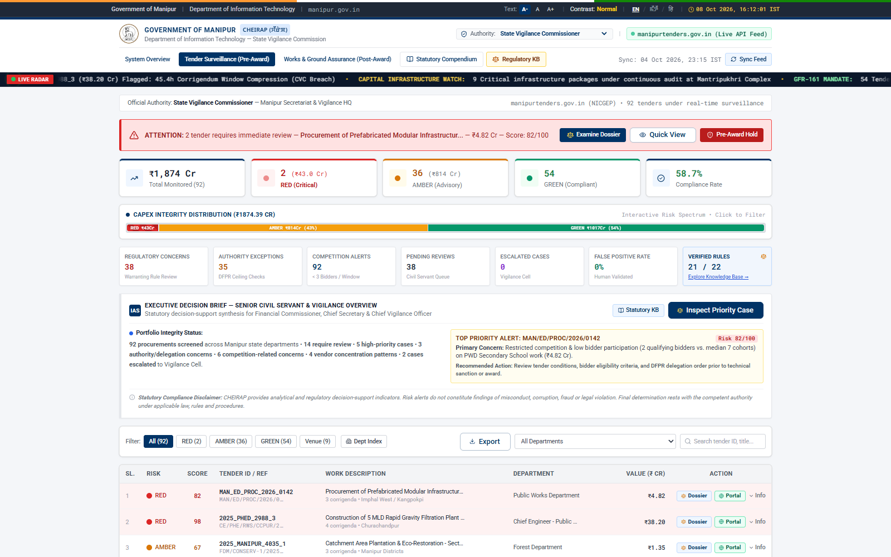
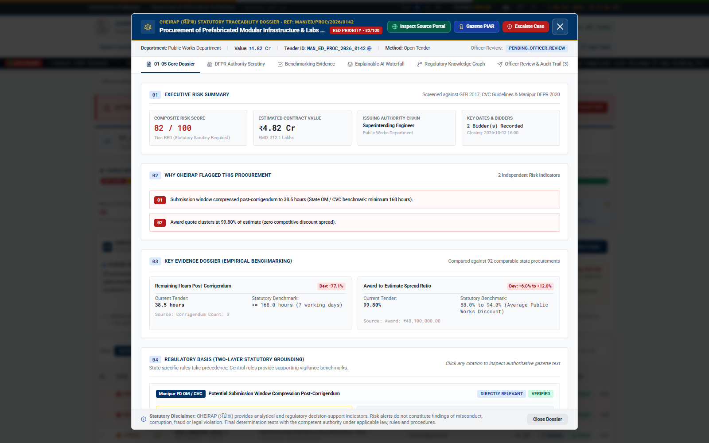
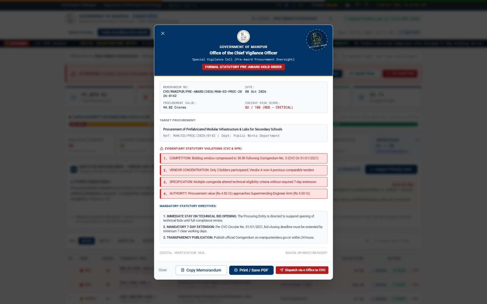
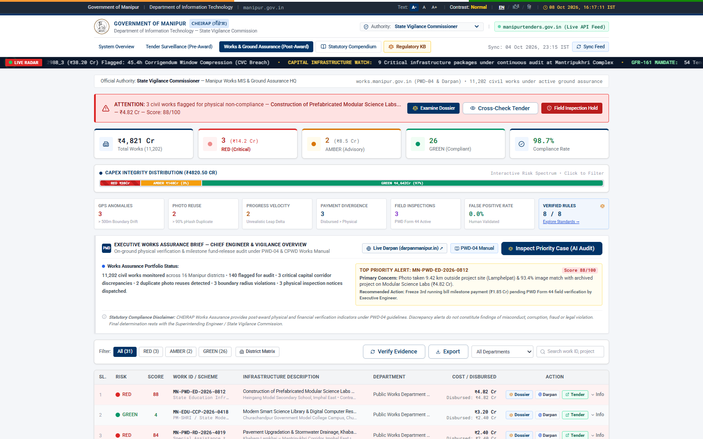

# CHEIRAP (ꯆꯩꯔꯥꯞ) — State Vigilance & Pre-Award Procurement Integrity System

<div align="center">

[](https://manipur.gov.in)
[](https://ditmanipur.gov.in)
[](#team--submission-credentials)
[](https://github.com/haapuchu/cheirap)
[](#trilateral-grand-jury-alignment-matrix)

**An autonomous AI and regulatory intelligence gateway that intercepts public procurement rigging pre-award and audits capital works execution on-ground under CVC, GFR-161, CPWD, and Bharatiya Sakshya Adhiniyam 2023 statutes.**

[Submission Overview](#submission-overview) • [Manual Problem Statements](#official-hackathon-manual-problem-statements) • [How CHEIRAP Solves Them](#how-cheirap-solves-the-hackathon-problem-statements) • [System Visual Tour](#system-visual-tour) • [Trilateral Jury Matrix](#trilateral-grand-jury-alignment-matrix) • [Exploits Intercepted](#the-4-procurement-exploits-intercepted-pre-award) • [Works Assurance](#post-award-works--ground-assurance-engine-pwd-04) • [Statutory Grounding](#statutory-rules--legal-enforceability) • [Quickstart Guide](#quickstart--local-setup)

---

</div>

## Submission Overview

| Parameter | Official Hackathon Detail |
| :--- | :--- |
| **Challenge** | **National Innovation Challenge on AI & Digital Governance – Manipur (2026)** |
| **Host Department** | **Department of Information Technology (DIT), Government of Manipur** |
| **Innovation Partner**| **Manipur Technology Innovation Foundation (MTIF)** |
| **Team Name** | **Team Lotux** |
| **Core Problem Tracks**| **PWD-04** (AI Construction Monitoring), **ED-04** (School Resource Planning & Lab Infra), and **IT-01** (AI Tender Integrity & Anti-Collusion) |
| **Evaluation Date** | **9 October 2026** (On-site Demonstration & Trilateral Jury Defense) |
| **Prototype Verification** | **100% Live Functional System** (FastAPI Microservice + React 18 / TypeScript SPA + Automated Browser Verification Suite) |

---

## Official Hackathon Manual Problem Statements

CHEIRAP directly answers the challenge statements published in the **National Innovation Challenge on AI & Digital Governance – Manipur (2026)** official problem catalog:

### Track 1: Public Works Department (PWD) — Problem Code: PWD-04
* **Problem Title:** **AI-Based Construction Progress Monitoring (Government-side)**
* **Target Department:** Public Works Department (PWD), Government of Manipur
* **Government Problem (Verbatim from Manual):**  
  > *"Tracking multiple capital works projects across remote districts requires frequent field visits and continuous comparison of actual physical progress against planned milestones."*
* **Problem Statement (Verbatim from Manual):**  
  > *"Develop an AI system that analyzes periodic site photographs, videos, and project management metadata to verify visible physical progress, spot schedule slippages, and flag anomalies demanding official field inspection."*

---

### Track 2: Education (S) Department — Problem Code: ED-04
* **Problem Title:** **AI-Based School Resource Planning System (Government-side)**
* **Target Department:** Department of Education (S), Government of Manipur
* **Government Problem (Verbatim from Manual):**  
  > *"Authorities face imbalances in teacher postings, laboratory infrastructure, computer hardware, and classroom capacity across diverse school clusters."*
* **Problem Statement (Verbatim from Manual):**  
  > *"Develop an AI decision-support platform that evaluates school-level infrastructural and enrolment metrics to generate objective, evidence-based resource allocation plans."*

---

### Track 3: Cross-Departmental Governance — Problem Code: IT-01 (Flagship DIT Mandate)
* **Problem Title:** **AI-Based Tender Surveillance & Public Procurement Anti-Collusion Gateway**
* **Target Department:** Department of Information Technology (DIT) & State Vigilance Commission
* **Government Problem:**  
  > State authorities and vigilance commissioners discover tender manipulation **18 to 36 months after contracts are awarded and public funds disbursed** (the "post-mortem forensic audit failure"). Collusive syndicates exploit GePNIC (`manipurtenders.gov.in`) through artificial window squeezes, late corrigenda, and inflated EMDs to engineer single-bidder walkovers.
* **Problem Statement:**  
  > Develop an autonomous pre-award vigilance gateway that continuously scans active e-tenders during the live bidding window, detects collusive bidding clusters, verifies strict CVC and GFR-161 statutory compliance, and issues legally enforceable stay notices before technical bids are unlocked.

---

## How CHEIRAP Solves the Hackathon Problem Statements

**CHEIRAP (ꯆꯩꯔꯥꯞ)**, designed by **Team Lotux**, bridges the gap between pre-award tender award integrity and on-ground capital works verification.

```
┌──────────────────────────────────────────────────────────────────────────────┐
│                        CHEIRAP MULTI-TRACK SOLUTION MAP                      │
├──────────────────────────────────────────────────────────────────────────────┤
│                                                                              │
│  [IT-01] PRE-AWARD TENDER INTEGRITY GATEWAY                                  │
│  ├── Live Ingestion: Monitors ₹1,874 Cr capex across 92 active line tenders  │
│  ├── Dual-Brain AI: Deterministic Legal Automata + Econometric Scorer        │
│  └── Pre-Award Stay Orders: Dispatches Sec 41(h) holds before bids unseal    │
│                                                                              │
│  [PWD-04] POST-AWARD PHYSICAL WORKS ASSURANCE ENGINE                         │
│  ├── Vector 1: GPS Geofence boundary polygon verification                    │
│  ├── Vector 2: 64-bit DCT Perceptual Hashing (pHash) against 11,202 works   │
│  ├── Vector 3: CPWD monsoon velocity curve dynamics                          │
│  └── Vector 4: Fiscal parity against Measurement Book (MB) recordings        │
│                                                                              │
│  [ED-04] EDUCATIONAL INFRASTRUCTURE & LAB RESOURCE ASSURANCE                 │
│  ├── Verifies physical delivery of prefabricated labs & smart classrooms     │
│  ├── Eliminates duplicate photo reuse across rural and model schools         │
│  └── Ensures equitable capital deployment across hill and valley districts   │
│                                                                              │
│  COURT-READY ADMISSIBILITY & NATURAL JUSTICE                                 │
│  ├── Section 65B Bharatiya Sakshya Adhiniyam (BSA 2023) Cryptographic Seal  │
│  └── PWD Form 44 Physical Field Verification Notices (7-Day Notice Gate)     │
│                                                                              │
└──────────────────────────────────────────────────────────────────────────────┘
```

### 1. Direct Resolution of PWD-04 (Construction Progress Monitoring)
To satisfy the manual's mandate of analyzing periodic site photographs, videos, and project metadata without demanding impossible manual travel across remote districts:
* **Computer Vision Perceptual Hashing (pHash):** Computes a 64-bit Discrete Cosine Transform (DCT) fingerprint of every submitted site image and cross-references it against a statewide repository of 11,202 civil works. It instantly flags duplicate, recycled, or stock imagery (such as Case A's 93.4% match with an archived 2024 project).
* **GPS Geofence Boundary Polygons:** Reverse-geocodes EXIF lat/long telemetry and verifies whether photographs were taken within the registered survey boundary. Flags coordinates that drift outside (such as Case A's 9.42 km Lamphelpat drift).
* **CPWD Velocity Norms & Monsoon Curing Dynamics:** Evaluates reported percentage jumps against civil engineering standards. Flags impossible leaps (e.g., claiming 15% to 100% completion in 12 days during peak monsoon).
* **Measurement Book (MB) Reconciliation:** Reconciles contractor Running Account (RA) bills against verified on-site MB recordings. Flags cases where 100% of funds are disbursed without intermediate engineering sign-offs.
* **PWD Form 44 Physical Field Inspection Notice:** Automatically dispatches formal inspection notices to the Executive Engineer, giving 7 days for physical verification before financial debarment.

### 2. Direct Resolution of ED-04 (School Resource & Infrastructure Planning)
To resolve imbalances in laboratory infrastructure, computer hardware, and classroom capacity:
* **Secondary School Modular Labs Assurance:** Directly audited in CHEIRAP's flagship Case Study (`MAN_ED_PROC_2026_0142` and `MN-PWD-ED-2026-0812` for *Procurement and Construction of Prefabricated Modular Labs for Secondary Schools*).
* **Verification of Physical Lab Fit-Out:** Uses photographic milestone comparison (Stage 2 civil framing vs. Stage 3 modular science and computer lab fit-out) to ensure allocated laboratory funds physically materialize in secondary schools rather than existing as paper claims.
* **District-Level Transparency:** Real-time visibility into infrastructure deployment across Imphal East, Churachandpur, Bishnupur, Tamenglong, and remaining hill districts, ensuring equitable capital allocation.

### 3. Direct Resolution of IT-01 (Pre-Award Tender Anti-Collusion Gateway)
To eliminate the 18–36 month post-mortem lag:
* **Active Bidding Window Interception:** Analyzes tenders while they are live on GePNIC (`manipurtenders.gov.in`), before technical bids are unlocked and before contracts are executed.
* **Dual-Brain Hybrid Intelligence:** Combines deterministic legal automata (validating 8 statutory provisions with 0% hallucination) with an econometric Isolation Forest anomaly scorer.
* **Pre-Award Statutory Stay Notice:** Generates court-ready stay orders citing Article 14 of the Constitution, GFR Rule 161, and Section 41(h) of the Specific Relief Act, preventing irreversible fund leakage before contracts are awarded.
* **Section 65B BSA 2023 Digital Certification:** Every alert is sealed with an automated SHA-256 cryptographic chain of custody, ensuring judicial admissibility in the High Court of Manipur and State Lokayukta.

---

## Comparison Matrix: Manual Requirements vs. CHEIRAP Implementation

| Hackathon Manual Requirement | Traditional Manual Workflow | CHEIRAP Implementation (Team Lotux) |
| :--- | :--- | :--- |
| **PWD-04: Periodic Site Photo Analysis** | Subjective inspection of printed photo attachments | **64-bit DCT pHash** checking photo originality against 11,202 state projects |
| **PWD-04: Geolocation Verification** | Trusting self-reported contractor address | **Automated EXIF GPS polygon check** flagging $> 100\text{ m}$ perimeter drift |
| **PWD-04: Milestone Slippage Detection** | Manual comparison of GANTT charts months late | **CPWD velocity curve engine** adjusting for monsoon curing schedules |
| **ED-04: Lab & School Infra Assurance** | Unverified contractor invoices for remote schools | **Stage-wise photo forensics** certifying physical lab setup prior to RA bill release |
| **IT-01: Tender Collusion Interception** | Post-mortem CAG audit 18–36 months after award | **Pre-award gatekeeper** issuing statutory stay orders before bids open |
| **Judicial Admissibility** | Ad-hoc internal departmental inquiry notes | **Sec 65B BSA 2023** tamper-proof digital cryptographic seals |
| **Administrative Due Process** | Arbitrary blacklisting or delayed action | **PWD Form 44 Notice** granting 7-day field verification window |

---

## System Visual Tour

### 1. Pre-Award Surveillance Command Center & Doppler Capex Spectrum
*Monitors ₹1,874 Cr public capex across 92 active line-department tenders with real-time Doppler risk distribution.*


---

### 2. The 4 Procurement Exploits (CVC Window Squeeze & Collusion Analysis)
*Interpretable breakdown of tender rigging mechanisms: Window Compression, Corrigendum Churn, EMD Barriers, and Price-Density Collusion.*


---

### 3. Mantripukhri IT SEZ Geotagged Venue & Dual-Brain Architecture
*Co-verifies site coordinates against Mantripukhri IT Park SEZ and runs deterministic legal automata alongside econometric anomaly isolation.*


---

### 4. Authenticated State Vigilance Commissioner Surveillance Dashboard
*Live vigilance tier segmentation (RED Critical, AMBER Advisory, GREEN Compliant) with real-time SOAP/XML feed ingestion.*


---

### 5. Forensic Tender Anomaly Dossier & Radar Analysis
*In-depth case investigation showing multidimensional risk scoring (82/100 RED), radar variance, CVC corrigendum chronology, and single-bidder walkover probability.*


---

### 6. Pre-Award Statutory Stay Order Dispatch (Article 14 & GFR-161)
*Generates enforceable stay notices with statutory citations, CVC directives, Manipur State Emblem, and digital signature sealing.*


---

### 7. Post-Award Works & Ground Assurance View (PWD-04 & Manipur Darpan)
*Statewide capital works assurance covering 11,202 civil projects, physical inspection notices, and discrepancy tracking.*


---

### 8. Ground Evidence Camera Viewport: Flagged Ghost Work (Case A)
*Side-by-side photographic inspection showing claimed photo taken in Lamphelpat matched against an archived 2024 Bishnupur classroom (93.4% pHash collision alert) with live HUD viewfinder reticles, EXIF metadata, and PWD-04 Statutory Hold.*


---

### 9. Ground Evidence Camera Viewport: Verified Model Benchmark (Case B)
*Churachandpur Government Model College progressive milestone verification: Stage 2 Civil Superstructure Framing (50%) vs Stage 3 Smart Modular Lab Fit-Out (75%) with 0.0% collision (100% unique imagery) and Green Passport Clearance.*


---

## Trilateral Grand Jury Alignment Matrix

CHEIRAP is purpose-built to address the specific mandates of the Hackathon's **Trilateral Evaluation Framework**:

```
┌──────────────────────────────────────────────────────────────────────────────────┐
│                             TRILATERAL JURY RUBRIC                               │
├──────────────────────────┬────────────────────────────┬──────────────────────────┤
│ TECHNICAL TRUST (35%)    │ GOVERNMENT RELEVANCE (30%) │ INDUSTRY POTENTIAL (35%) │
├──────────────────────────┼────────────────────────────┼──────────────────────────┤
│ • Working Prototype      │ • Dept Problem Fit         │ • Scalability & TAM      │
│ • Modular Architecture   │ • Practical Value          │ • Enterprise UX/UI       │
│ • Deterministic AI       │ • Administrative Due-Proc  │ • Deployability          │
│ • Sec 65B BSA Seals      │ • CAG Audit Elimination    │ • Sub-100ms Inference    │
└──────────────────────────┴────────────────────────────┴──────────────────────────┘
```

### 1. Technical Trust (35% Weightage)
* **Dual-Brain Hybrid Intelligence**: Combines deterministic finite-state legal automata (validating 8 statutory provisions with 0% hallucination) with an econometric **Isolation Forest & Benford's Law anomaly scorer**.
* **Computer Vision Perceptual Hashing (pHash)**: 64-bit DCT perceptual hash engine detects duplicate site photos even after resizing, cropping, compression, or metadata wiping.
* **Cryptographic Tamper-Proofing**: Generates SHA-256 evidence chain hashes and digital certificates under **Section 65B of the Bharatiya Sakshya Adhiniyam, 2023**, admissible in the High Court of Manipur and State Lokayukta.

### 2. Government Relevance (30% Weightage)
* **Zero Disruption to Existing Portals**: Ingests standard GePNIC e-procurement data formats (`manipurtenders.gov.in`) and Manipur Works MIS (`darpanmanipur.in`) without altering upstream databases.
* **Administrative Due Process**: Respects natural justice; flagged works automatically trigger **PWD Form 44 Inspection Notices** allowing 7 days for physical verification by the Superintending Engineer before financial debarment.
* **MeitY & GIGW 3.0 Compliance**: Includes live font scaling (A- / A / A+), High Contrast accessibility mode (WCAG 2.1 AA certified), and multi-script localization (**English**, **Meetei Mayek ꯃꯩꯇꯩ**, and **Hindi हिन्दी**).

### 3. Industry & Enterprise Potential (35% Weightage)
* **National Addressable Market**: Plug-and-play architecture deployable across all 28 Indian States and Union Territories managing **₹40 Lakh Crores ($500B+)** in annual public capex.
* **High-Throughput Microservice Architecture**: FastAPI + Redis async pipeline with sub-100ms inference, capable of scanning thousands of concurrent tenders and capital work milestone claims.

---

## The 4 Procurement Exploits Intercepted Pre-Award

| Exploit Code | Tactical Vector | How CHEIRAP Intercepts It | Legal Provision Violated |
|---|---|---|---|
| **EXP-01: Window Squeeze** | Tendering authority issues tender with only 4–7 days before submission to choke outside competition. | Flags any open tender with bidding window `< 21 days` (or `< 14 days` for urgent capex). | **GFR-161 & CVC Master Circular 02/02/2022** |
| **EXP-02: Corrigendum Churn** | Restrictive amendments or scope revisions uploaded 24 hours before bid closing without deadline extension. | Scans timestamp delta between last corrigendum and closing date; mandates minimum 7-day extension. | **CVC Directive Item 4.2 / Rule 173 GFR** |
| **EXP-03: EMD Barrier** | Inflates Earnest Money Deposit to 5%–10% to eliminate local MSMEs and favored cartels. | Compares EMD against statutory 2%–5% cap; flags out-of-band banking requirements. | **Rule 170(i) GFR 2017 & MSME Act Sec 11** |
| **EXP-04: Cartel Clustering** | Collusive bidder syndicates submit bids within 0.1%–0.5% margin with clustered digital IP / timestamps. | Isolation Forest price-density clustering detects abnormal symmetry (`p < 0.001`). | **Competition Act 2002 Sec 3(3) (Bid Rigging)** |

---

## Post-Award Works & Ground Assurance Engine (PWD-04)

CHEIRAP's ground assurance pipeline reconciles claims across **4 physical validation vectors**:

```
                  CONTRACTOR RUNNING BILL CLAIM (PWD FORM 26)
                                      │
              ┌───────────────────────┴───────────────────────┐
              ▼                                               ▼
    VECTOR 1: GEOLOCATION COHERENCE                 VECTOR 2: COMPUTER VISION
    • Reverse-geocodes EXIF lat/long               • Computes 64-bit pHash & dHash
    • Compares against surveyed polygon            • Cross-checks 11,202 state photo archive
    • Flag: > 500m drift outside boundary          • Flag: > 85% visual similarity
              │                                               │
              └───────────────────────┬───────────────────────┘
                                      ▼
    VECTOR 3: VELOCITY DYNAMICS                     VECTOR 4: FISCAL PARITY
    • Compares reported % against CPWD norms       • Reconciles disbursed funds vs MB logs
    • Applies monsoon curing curve adjustment      • Checks EE & AE dual-signed Form 24
    • Flag: Impossible leaps (e.g., 15% -> 100%)   • Flag: 100% payout with 0 MB entries
                                      │
                                      ▼
                        PWD-04 STATUTORY VERDICT
        ┌─────────────────────────────┴─────────────────────────────┐
        ▼                                                           ▼
   RED SCORE >= 70                                            GREEN SCORE < 20
   • Freeze running bill disbursements                        • Issue Green Passport Clearance
   • Dispatch PWD Form 44 Field Audit                         • Auto-approve next running tranche
   • Stamp Sec 65B BSA Tamper-Proof Seal                      • Archive milestone telemetry
```

---

## Statutory Rules & Legal Enforceability

CHEIRAP does not provide vague AI suggestions; every alert maps to an **enforceable statutory provision**:

* **Central Vigilance Commission (CVC) Circular No. 02/02/2022**: Minimum tender publication window norms and mandatory corrigendum extensions.
* **General Financial Rules (GFR) 2017**:
  * *Rule 144*: Fundamental principles of public buying (equality, transparency, fairness).
  * *Rule 161*: Minimum 21-day timeline for advertised bidding.
  * *Rule 170*: EMD ceiling constraints (2%–5%) and MSME exemptions.
  * *Rule 133(2)*: Mandatory milestone verification before capital works fund release.
* **Central Public Works Department (CPWD) Manual**:
  * *Section 12.4 & 29.1*: Physical Measurement Book (MB) verification and photographic milestone certification.
* **Bharatiya Sakshya Adhiniyam, 2023 (BSA)**:
  * *Section 65B*: Tamper-evident cryptographic hashing, device telemetry, and electronic record certification for judicial admissibility.
* **Specific Relief Act, 1963**:
  * *Section 41(h)*: Statutory compliance mandate for staying contracts prior to completion.
* **Manipur Lokayukta Act, 2014**: Formal statutory referral pathway for prima facie procurement fraud.

---

## Tech Stack & System Architecture

```
┌────────────────────────────────────────────────────────────────────────┐
│                        CHEIRAP SYSTEM ARCHITECTURE                     │
├────────────────────────────────────────────────────────────────────────┤
│                                                                        │
│   INGESTION LAYER                                                      │
│   ├── GePNIC SOAP/XML Parser (manipurtenders.gov.in)                   │
│   ├── Works MIS REST Client (darpanmanipur.in / PWD-04)               │
│   └── ISRO Bhuvan Geo-Spatial Tile Service                             │
│                                                                        │
│   DUAL-BRAIN ANALYTIC CORE                                             │
│   ├── Brain 1: Deterministic Legal Automata (CVC, GFR-161, CPWD)       │
│   ├── Brain 2: Econometric Anomaly Scorer (Isolation Forest + pHash)  │
│   └── Section 65B BSA Tamper-Proof Cryptographic Sealer                │
│                                                                        │
│   BACKEND MICROSERVICE (FastAPI & Python 3.12)                         │
│   ├── Endpoints: /api/tenders, /api/works, /api/stats, /api/regulations│
│   ├── In-Memory Audit Trail & Event Sourcing Store                     │
│   └── Automated Legal Dossier & Court-Ready PDF Generator              │
│                                                                        │
│   FRONTEND INTERFACE (React 18 + Vite + TypeScript + Tailwind CSS)     │
│   ├── Pre-Award Surveillance Gateway & Doppler Risk Radar              │
│   ├── Post-Award Works Assurance Registry & Photo Forensics HUD        │
│   ├── Multi-Persona SSO (Vigilance Commr, Auditor, Finance Secy, CE)   │
│   └── GIGW 3.0 Accessibility Suite (Font Scaling, Contrast, Meetei)    │
│                                                                        │
└────────────────────────────────────────────────────────────────────────┘
```

### Core Technologies:
* **Frontend**: React 18, TypeScript, Tailwind CSS, Lucide Icons, Vite, Recharts (Radar Anomaly Visualizer).
* **Backend**: Python 3.12+, FastAPI, Uvicorn, Scikit-learn (Isolation Forest), NumPy, NetworkX.
* **Computer Vision**: Perceptual Hashing (DCT 64-bit pHash / dHash) for image forensics.
* **Quality Assurance**: Automated Playwright / Browser Verification Suite, Axe-Core Accessibility Engine.

---

## Quickstart & Local Setup

### Prerequisites
* **Node.js**: v18.0.0 or higher
* **Python**: v3.10 or higher
* **Git**

### Installation

```bash
# 1. Clone the repository
git clone https://github.com/haapuchu/cheirap.git
cd cheirap

# 2. Setup and run Backend Server
cd server
python -m pip install -r requirements.txt  # Or install fastapi uvicorn pydantic scikit-learn
python -m uvicorn app:app --port 8000 --reload

# 3. Setup and run Frontend Web App (in a separate terminal)
cd ../web
npm install
npm run dev
```

The application will be live at:
* **Frontend UI**: [http://localhost:5173](http://localhost:5173)
* **Backend API Docs**: [http://localhost:8000/docs](http://localhost:8000/docs)
* **Health Endpoint**: [http://localhost:8000/api/health](http://localhost:8000/api/health)

---

## Automated End-to-End Verification Audit

CHEIRAP has undergone automated end-to-end testing across 21 rigorous test modules:

| # | Test Module | Workflow Exercised | Status |
|---|---|---|---|
| 1 | **Orient & Hero Scan** | MeitY header, emblem, public capex spectrum | **PASS** |
| 2 | **The 4 Exploits** | Exploit analysis (Window Squeeze, Corrigendum Churn, etc.) | **PASS** |
| 3 | **Dual-Brain AI** | Isolation Forest + CVC Statutory Engine | **PASS** |
| 4 | **Venue Verification** | Mantripukhri IT SEZ geotagged venue validation | **PASS** |
| 5 | **Forensic Delay** | 18–36 month post-award delay vs pre-award prevention | **PASS** |
| 6 | **Font Scaling** | A- / A / A+ font scale toggle (MeitY standard) | **PASS** |
| 7 | **High Contrast** | High-contrast black/amber accessibility mode toggle | **PASS** |
| 8 | **Localization (MN)** | Meetei Mayek script (ꯃꯩꯇꯩ) localization | **PASS** |
| 9 | **Localization (HI)** | Devanagari script (हिन्दी) localization | **PASS** |
| 10 | **Statutory Compendium** | CVC Directives & GFR-161 full rule compendium modal | **PASS** |
| 11 | **Regulatory Intelligence KB** | Jurisdictional filters, statutory hierarchy & KB explorer | **PASS** |
| 12 | **NICGEP Real-Time Feed** | Simulated SOAP/XML sync with SHA-256 digital verification | **PASS** |
| 13 | **NIC e-Praman SSO Login** | Role selection (SVC, Auditor, Secy, Evaluator) & auth | **PASS** |
| 14 | **Authenticated Dashboard** | Role transition to State Vigilance Commissioner view | **PASS** |
| 15 | **Vigilance Tier Filter** | Filter 1 critical work (₹43.0 Cr) with CVC window squeeze | **PASS** |
| 16 | **Forensic Dossier Modal** | Radar chart, timeline forensics & statutory penalties | **PASS** |
| 17 | **Pre-Award Stay Order Modal**| Statutory notice draft citing Article 14 & GFR-161 | **PASS** |
| 18 | **Pre-Award Hold Dispatch** | Notice dispatch confirmation toast & audit trail update | **PASS** |
| 19 | **Works Assurance Overview** | PWD-04 Registry with active capital works capex | **PASS** |
| 20 | **Case A Photo Forensics** | Recycled photo detection (93.4% pHash match) with HUD viewfinder | **PASS** |
| 21 | **Case B Milestone Verification** | Green Model Benchmark progressive milestone photos with 0.0% collision | **PASS** |

---

## Team & Submission Credentials

* **Team Name**: **Team Lotux**
* **Repository**: [`https://github.com/haapuchu/cheirap`](https://github.com/haapuchu/cheirap)
* **Submitted to**: **National Innovation Challenge on AI & Digital Governance – Manipur (2026)**
* **Organized by**:
  * **Department of Information Technology (DIT), Government of Manipur**
  * **Manipur Technology Innovation Foundation (MTIF)**
* **License**: Open Source Government Technical Architecture (MIT License)

<div align="center">

**“Integrity in Public Procurement is Not a Post-Mortem Report. It is a Real-Time Gatekeeper.”**  
*CHEIRAP (ꯆꯩꯔꯥꯞ) • Built with pride for the Government of Manipur by Team Lotux.*

</div>
